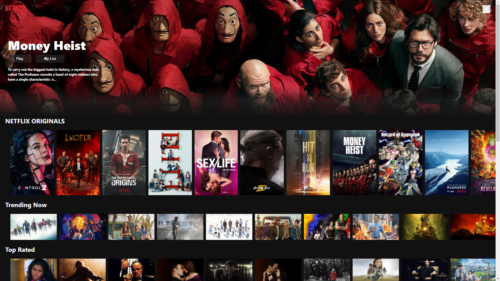

# js-netflix-clone

This is a Netflix Clone made over a few weekends while following [this tutorial](https://www.youtube.com/watch?v=XtMThy8QKqU) on Youtube. 
It replicates the look and feel of Netflix, and clicking on certain thumbnails will play the trailer for the movie. It does not play the actual movies.

## API

The project uses the API from [The Movie Database](https://www.themoviedb.org/) to get lists of movies that are used in Netflix.

## To Run

### Production 

This was deployed using Firebase and can be viewed live [here](https://js-netflix-clone.web.app/).

### Development

To run the code in development mode, download or clone the repo and run `npm start`

Open [http://localhost:3000](http://localhost:3000) to view it in the browser.

## To Build

Run `npm run build`

This builds the app for production to the `build` folder.

